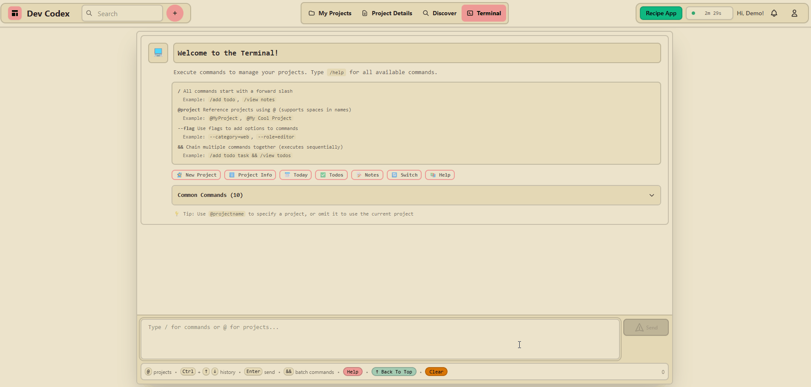

# Dev Codex

**The first project manager built for the AI era.**

Export your project to any LLM. Get back executable commands. Paste and run. Your entire project structure—built in seconds, not hours.

[](https://www.typescriptlang.org/)
[](https://reactjs.org/)
[](https://nodejs.org/)
[](https://www.mongodb.com/)
[](https://github.com/LFroesch/dev-codex)

---

## 🆓 Free & Open Source

**Clone it. Deploy it. It's yours. No strings attached.**

### Two Options:

**1. Self-Host (Free Forever)**
- Deploy anywhere (Railway, DO, AWS, your server)
- Set `SELF_HOSTED=true` → unlimited everything, no rate limits
- You control the data, infrastructure, and costs

**2. Use the Hosted Version**
- Production instance at [dev-codex.com](https://dev-codex.com)
- Optional paid plans for convenience
- Same features, but I handle deployment & monitoring
- Free tier: 3 projects to try it out

**Choose your path.** Self-hosting = control. Hosted = convenience. Both get the same great software.

---

## Why Dev Codex?

**Stop clicking through forms. Start thinking in commands.**

Traditional project managers force you to manually create every task, note, and feature through a UI. Dev Codex flips this: describe what you want to an LLM, get executable commands back, paste them in. Done.

### Terminal + Autocomplete

<!-- TODO: re-record with demo data -->


Type `/help` to see all 70+ commands. Tab-complete builds commands with flags and quoted values — no guessing syntax.

---

### Built-in AI Assistant

<!-- TODO: screenshot of AI proposing actions with checkboxes -->
<!--  -->

Type naturally — no slash prefix needed. The AI reads your project context and proposes actions you confirm with one click.

- **Multi-turn conversations** — follow-ups continue the session
- **Powered by Gemini 2.5 Flash** (prod) / Ollama (dev, $0 cost)
- **Works with external AI** — `/bridge` exports a command reference for CLAUDE.md/.cursorrules, `/context` exports project state

---

### The LLM Loop

<!-- TODO: re-record with demo data -->


**1. Export** — `/context prompt all` copies your entire project as an AI-optimized prompt

**2. Prompt** — paste into ChatGPT, Claude, or any LLM and ask it to generate commands

**3. Paste & run** — drop the commands back into the terminal. Idea to structured project in 30 seconds.

---

### Feature Graph

<!-- TODO: screenshot of feature graph with 8-10 nodes -->
<!--  -->

Visualize your architecture. Features and their relationships rendered as a draggable, zoomable graph (ReactFlow).

---

## Core Features

<details>
<summary><strong>AI-First Terminal (70+ Commands)</strong></summary>

<!-- TODO: screenshot of terminal with autocomplete dropdown -->
<!--  -->

- **Built-in AI:** Type naturally — AI proposes actions, you confirm with one click
- **70+ Slash Commands:** Power-user shortcuts for everything
- **Batch Operations:** Chain commands with `&&` or newlines
- **Interactive Wizards:** `/wizard new` for guided setup
- **External AI:** `/bridge` (command reference for CLAUDE.md/.cursorrules), `/context` (project state export), `/usage` (token stats)
- **Workflow Helpers:** `/today`, `/week`, `/standup`, `/stale`, `/info`
- **Full History:** Navigate with up/down arrows

</details>

<details>
<summary><strong>Project Management</strong></summary>

<!-- TODO: screenshot of todos or notes page -->
<!--  TODO -->

- **Todos:** Subtasks, priorities, due dates, assignments, dependencies
- **Notes:** Real-time locking (10-min heartbeat prevents edit conflicts)
- **Dev Logs:** Daily progress journal with timestamps
- **Features:** Visual relationship graph (ReactFlow) with drag & zoom
- **Tech Stack:** Track technologies, packages, deployment config
- **Ideas:** Personal parking lot (separate from projects)
- **Import/Export:** JSON (100MB limit, XSS sanitized)

</details>

<details>
<summary><strong>Social & Discovery</strong></summary>

<!-- TODO: screenshot of discover feed -->
<!--  -->

- **Posts:** Share profile or project updates (public/followers/private)
- **Comments:** Threaded discussions on public projects (with replies)
- **Follow System:** Follow users for feed updates
- **Favorites:** Bookmark projects, get notified on updates
- **Discover Feed:** Explore public projects by technology, category
- **Custom Slugs:** `/discover/@username/project-slug`

</details>

<details>
<summary><strong>Team Collaboration</strong></summary>

- **3 Roles:** Owner / Editor / Viewer permissions
- **Email Invites** with token-based acceptance
- **Real-time Sync:** Socket.io (live notifications, activity feed, presence)
- **Activity Logs:** See who changed what, when
- **Team Analytics:** Time tracking, heatmaps, leaderboards
- **Note Locking:** Automatic conflict prevention

</details>

<details>
<summary><strong>Analytics</strong></summary>

<!-- TODO: screenshot of analytics heatmap -->
<!--  -->

- **Session Tracking:** 10s heartbeats, 5-min idle detection
- **Time Breakdown:** Per-project hours, daily/weekly summaries
- **Heatmaps:** Visualize when you work on each project
- **Team Stats:** Leaderboards, contribution tracking
- **Retention Data:** 30/90/365-day windows (plan-based)

</details>

<details>
<summary><strong>Admin Dashboard</strong> (Self-Hosted: Full Access)</summary>

<!-- TODO: screenshot of admin dashboard -->
<!--  -->

- User management (ban/unban, plan changes, password resets, refunds)
- Support tickets with Kanban board
- Database cleanup & optimization tools
- Analytics: conversion rates, user growth, feature adoption
- News/announcement system

</details>

---

## Tech Stack

**Frontend:**
- React 18 + TypeScript + Vite
- Tailwind CSS + DaisyUI (themes)
- TanStack Query (data fetching)
- Socket.io Client (real-time)
- ReactFlow (feature graph visualization)
- @dnd-kit (drag & drop)

**Backend:**
- Node.js + Express + TypeScript
- MongoDB with 30+ indexes, TTL collections
- JWT + Passport (Google OAuth)
- Stripe (billing)
- Socket.io (real-time updates)
- Resend (transactional emails)
- Sentry (error tracking)
- Jest (1000+ tests)

**AI:**
- Gemini 2.5 Flash (prod) / Ollama (dev, $0 cost — GPU or CPU) via OpenAI-compatible API
- Swappable to any OpenAI-compatible provider
- Structured JSON output, multi-turn sessions, context-aware

**Security:**
- bcrypt (password hashing)
- CSRF protection (csrf-csrf)
- XSS sanitization (DOMPurify)
- Rate limiting (express-rate-limit)
- Helmet (security headers)
- Input validation & sanitization

**API:** 200+ RESTful endpoints—[view full API docs](md_files/READMEs/API.md)

**Onboarding:** Interactive 14-step tutorial system for new users

---

## Quick Start

```bash
git clone https://github.com/LFroesch/dev-codex.git
cd dev-codex
npm install
cp backend/.env.example backend/.env  # Add your MongoDB URI, JWT secret, etc
npm run dev
```

**Dev URLs:** <http://localhost:5002> (frontend) | <http://localhost:5003> (backend)

---

## Running with Ollama (Local AI)

Dev Codex uses [Ollama](https://ollama.ai) for local, free AI features. No API keys needed.

### Install & Pull a Model

**Native install:** [ollama.ai/download](https://ollama.ai/download) — then `ollama serve`

**Docker:**
```bash
docker run -d -v ollama:/root/.ollama -p 11434:11434 --name ollama ollama/ollama
# NVIDIA GPU: add --gpus all (requires NVIDIA Container Toolkit)
```

**Pull the default model:**
```bash
ollama pull qwen2.5:3b
```

### Avoiding Cold Starts

By default Ollama unloads models from memory after 5 minutes of inactivity. The first request after that takes 10-30s to reload. You can disable this:

| Behavior | Env var on Ollama | RAM usage |
|----------|-------------------|-----------|
| **Always loaded** (no cold starts) | `OLLAMA_KEEP_ALIVE=0` | ~4-8 GB |
| **Unload after idle** (default) | `OLLAMA_KEEP_ALIVE=5m` | ~0 when idle |

**Docker — always loaded (no cold starts):**
```bash
docker run -d -e OLLAMA_KEEP_ALIVE=0 \
  -v ollama:/root/.ollama -p 11434:11434 --name ollama ollama/ollama
```

**Docker — update existing container:**
```bash
docker stop ollama && docker rm ollama
docker run -d -e OLLAMA_KEEP_ALIVE=0 \
  -v ollama:/root/.ollama -p 11434:11434 --name ollama ollama/ollama
```
> The `-v ollama:/root/.ollama` volume persists your downloaded models across container recreations.

**Native install:** Add `OLLAMA_KEEP_ALIVE=0` to your environment (e.g. `~/.bashrc`, systemd unit, or launchd plist).

### Backend Config

In your `backend/.env`:
```bash
OLLAMA_BASE_URL=http://localhost:11434   # default
OLLAMA_MODEL=qwen2.5:3b                  # default
AI_ENABLED=true
```

> **WSL2 users:** If Ollama runs on the Windows side (e.g. for GPU access), set `OLLAMA_HOST=0.0.0.0:11434` on Windows and point `OLLAMA_BASE_URL` to the gateway IP (`ip route show default | awk '{print $3}'`).

### Troubleshooting

| Issue | Fix |
|-------|-----|
| `ECONNREFUSED` | Ollama isn't running — `ollama serve` or `docker start ollama` |
| Slow first response | Model loading from disk — set `OLLAMA_KEEP_ALIVE=0` |
| Out of memory | Use a smaller model or reduce GPU layers (`num_gpu`) |
| Docker `--gpus` fails (NVIDIA) | Install [NVIDIA Container Toolkit](https://docs.nvidia.com/datacenter/cloud-native/container-toolkit/install-guide.html) |

---

## Deployment

**Self-Hosted (Railway example):**
```bash
npm install -g @railway/cli
railway login && railway init && railway up
```

**Required env vars:**
- `MONGODB_URI` (Atlas/Railway/your instance)
- `JWT_SECRET` & `CSRF_SECRET` (generate: `node -e "console.log(require('crypto').randomBytes(32).toString('hex'))"`)
- `FRONTEND_URL` & `CORS_ORIGINS`
- `SELF_HOSTED=true` (disables rate limits & billing)

**Optional:**
- Email: `RESEND_API_KEY` (verify your domain in the Resend dashboard)
- `GOOGLE_CLIENT_ID` & `GOOGLE_CLIENT_SECRET` for OAuth login
- `STRIPE_*` for billing (only needed if not self-hosted)
- `SENTRY_DSN` for error monitoring
- `OLLAMA_BASE_URL` + `AI_MODEL` for AI features (default: `http://localhost:11434`, `qwen2.5:7b`)

**What `SELF_HOSTED=true` does:**
- ✅ Unlimited projects, team members, requests
- ✅ Unlimited AI (no token caps, no rate limits)
- ✅ No billing/subscription features
- ✅ Stripe becomes optional (billing disabled)
- ✅ Email becomes optional (but recommended for invitations/password resets)

[Full deployment guide →](md_files/READMEs/DEPLOYMENT.md#self-hosted-deployment)

---

## Plan Tiers

**Self-Hosted:** Unlimited everything when `SELF_HOSTED=true` (including AI with your own Ollama instance)

**Hosted Version:**
| Plan | Price | Projects | AI | Team | Content/project | Analytics |
|------|-------|----------|-----|------|-----------------|-----------|
| **Free** | $0 | 3 | 3 queries/day | 3/project | 50 todos, 20 notes | 30 days |
| **Demo** | — | Read-only | 3 queries/day | — | — | — |
| **Pro** | $5/mo | 20 | 500k tokens/mo, 15/min | 10/project | 200 todos, 100 notes | 90 days |
| **Premium** | $15/mo | Unlimited | 2M tokens/mo, 30/min | Unlimited | Unlimited | 365 days |

---

## Scripts

| Command | Description |
|---------|-------------|
| `npm run dev` | Start frontend + backend |
| `npm run build` | Production build |
| `npm test` | Run backend tests |
| `npm run test:all` | Run backend + frontend tests |
| `npm run create-admin` | Create admin user |
| `npm run seed-demo` | Seed demo user with sample data |

---

## License

AGPL-3.0 — see [LICENSE](LICENSE)

---

## Support

**Issues:** <https://github.com/LFroesch/dev-codex/issues>

**Built by a developer, for developers.**
